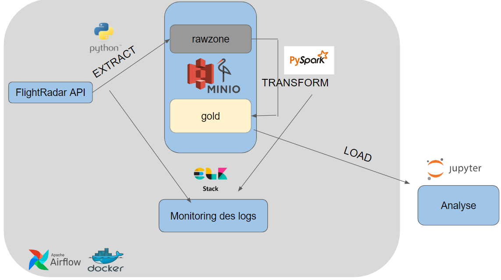

## Contexte et objectif
La pipeline d'extraction est pensée pour être schéduleée et exécuter dans airflow et contien deux grandes étapes qui représenteront chacune une task du dag ETL
 - La partie extraction : un opérateur Python qui se charge d'éxécuter le script python d'extraction des données et de les charger dans le bucket "rawzone" dans MinIO"

 - La partie clean_and_transform : un opérateur Bash qui se charge de soumettre via Spark-Submit la tâche de cleaning et de transformation des données à un clusteur spark composé d'un master et deux worker. A l'issu de ce traitement la donnée est chargée dans le bucket "gold" toujours dans MinIO.

### Architecture globale cible

 ## NB : 
La configuration Airflow n'étant pas encore terminée, le projet ne peut s'éxecuter de bout en bout de manière schédulée et automatisée. Néanmoins les deux grandes paties sont testables (exécuter à la main les différents scripts) de manière séquentielles afin de simuler l'extraction puis la nettoyage et la transformation, avec chargement de la données à la fin de chaque étape

# Présenation de l'architecture du projet
 - Backup_data : contient un fichier json dans lequel sont stockés les paths des fichiers extraits et stocké dans minIO pour faciliter l'import dans la phase suivante

 - Extract : Module d'extraction des données

 - Transform : Module de cleaning et transformation avec pyspark

 - Logger : Module contenant un logger qui permet de tracer les log d'éxecution des différentes étapes de traitement. Les logs sont stockés dans le dossier ETL_logs. par la suite il est prévu de faire une gestion de log avec la stack ELK pour lieux faciliter le monotoring de manière centralisée et plus visuelle à l'aide de kibana

 - Logstash : Contient la config pour la pipeline de log : Filebeat --> Logstash --> Elasticsearch --> Kibana (A venir)

 - Data_extracted : Contient un echantillon des données extraites pour exemple 

# Les différents services 
Nous avons fait le choix de dockeriser tous les services nécéssaires au fonctionnement de l'application. Le fichier docker compose général "docker-compose.yml" contient les services suivants : 

 - Cluster spark (1 master et 2 worker). Le Dockerfile-spark ajoute les installations  des packages python requis à l'image spark de base utilisé

 - MinIO : une solution de stockage d'objet distribuée qui nous permet de construire nos datalake. Nous avons fait le choix d'appliquer l'architechture medaillon avec découpage rawzone et gold. Nous n'avons pas jugé très utile un dépôt intermédiaire car il n'a pas beaucoup de traitement à faire sur les données

 - Stack ELK : Services Logstash, Elasticsearch et Kibana

 - La config d'Airflow gérée en indépendante dans le dossier (fusion avec le docker compose général à venir)

 Le cluster spark et MinIO sont monté sur le même network afin de faciliter la communication entre les deux.

 # Comment executer le projet ?
 Ces étapes décriront l'éxécution à la main de la pipeline (qui n'est pas encore automatisée)

 ## Pre-requis sur la machine d'éxécution
  - docker
  - un environnement python (conda ou virtualenv)
    - activer son environnement et lancer la commande d'installation des package python : pip install -r /requirements.txt
## Exécution 
 - se placer dans le dossier ETL_spark et lancer les container docker : docker-compose -f docker-compose.yml up -d

 - Une fois les services lancés, se connecter à l'interface de MinIO à l'adresse : http://localhost:9001 (login : test et password : test6886) pour générer afin de générer une clé d'accès. 
   - Une fois connecté sur MinIo, dans l'onglet "Accès Key" cliquer sur "Create access key" et en générer une
   
   - enfin modifier le fichier .env dans src/ et remplacer MINIO_ACCESS_KEY et MINIO_SECRET_KEY par ce que vous venez de générer.

 - se placer dans  "ETL spark/src/Extract"et lancer l'extraction des données : python ./extractor.py
 
 - Une fois terminé, se placer dans "ETL spark/src/ et lancer le cleaning et la ransformation ds données : python ./submit_task_to_spark.py. Ce script envoie la tâche à éxécuter au cluster spark.

    Voici ce à quoi s'attendre à la fin :

    Les deux buckets créés 
    

    Les données extraites dans rawzones
    

    Les données extraites dans gold
    

## Modélisation de la données 

  

